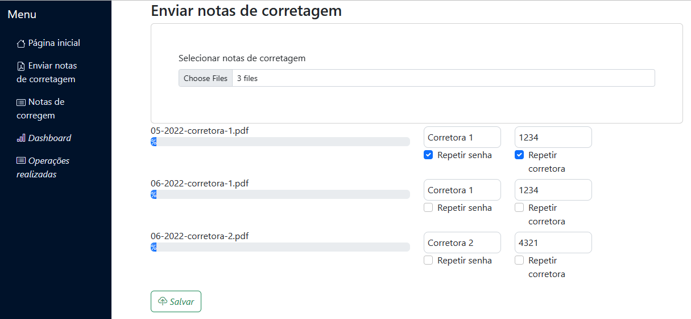
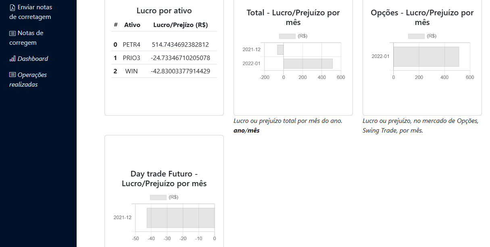
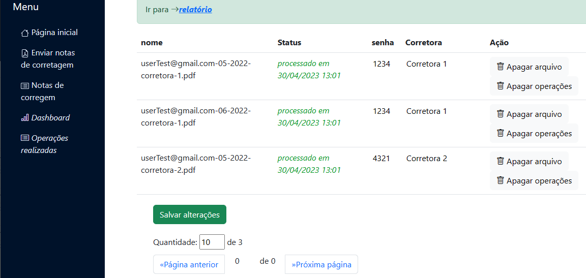
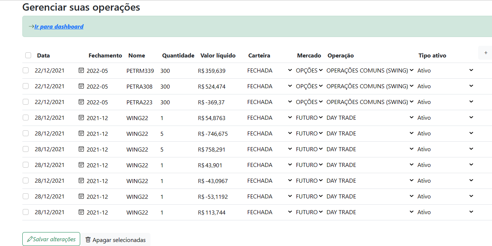

<h1>A Brokerage Notes Manager</h1>
<h2>The Idea</h2>

It extracts the content of the brokerage notes and balances the operations.

It provides the separation of operations closed by selling or buying an asset or option. It also provides the open operations.

It provides the profit or debt by month or by asset.

Actually, with the correct balance, it is possible to have any statistic, such as profit for any period, any asset/option, or any group of assets/options in any period.

<h2>What is Already Implemented</h2>

Some of the features are already implemented, as described below in the figures:

 

Figure 1: Send brokerage notes in PDF format to be processed.

 

Figure 2: Dashboard interface which provides some charts.

 

Figure 3: List of brokerage notes.

 

Figure 4: List of operations extracted from the PDF files.

<h2>What Still Doesn't Work</h2>

Extracting this information from PDF files is a challenge. The Java libraries used have high quality in text extraction from PDFs; however, some inconsistencies occurred during deployment testing. On the other hand, the Python libraries have better accuracy in text extraction but encounter some problems with multitasking processing. Both have been tested, and the Python issue can be resolved more easily than the Java libraries' problem. These issues have already been identified for future implementation. Feel free to fork this project and use it as you wish or try to solve these problems.
